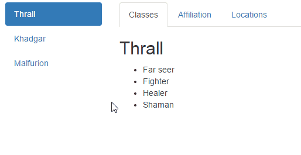

# Ember-cross-models-routing

[](https://travis-ci.org/onechiporenko/ember-cross-models-routing)
[](https://www.codacy.com/app/cv_github/ember-cross-models-routing?utm_source=github.com&amp;utm_medium=referral&amp;utm_content=onechiporenko/ember-cross-models-routing&amp;utm_campaign=Badge_Grade)
[](https://emberobserver.com/addons/ember-cross-models-routing)
[](http://badge.fury.io/js/ember-cross-models-routing)
[](http://doge.mit-license.org)
[](https://www.npmjs.com/package/ember-cross-models-routing)

## Install

```bash
ember install ember-cross-models-routing
```

## Usage

See [demo](http://onechiporenko.github.io/ember-cross-models-routing/) site

And small demo gif <small>(by [ScreenToGif](https://github.com/NickeManarin/ScreenToGif))</small>



### Give me the code!

OK. Let's look at the example bellow.

There is a model called `user`. It represents one of the WoW persons (don't ask why it called `user`). Its fields `locations`, `affiliation` and `classes` are arrays of strings. Each field is shown on the its own page. As you can see on the top gif, vertical menu is for users and top menu is for their fields. `ember-cross-models-routing` allows to navigate across models with preservation of the child route. If you are on the Malfurion's Locations and then click on Thrall, you'll be moved to the Thrall's Locations. 

```javascript
// app/models/user.js

import DS from 'ember-data';

export default DS.Model.extend({

  name: DS.attr('string'),
  locations: DS.attr(),
  affiliation: DS.attr(),
  classes: DS.attr()

});
```

```javascript
// app/router.js

import Ember from 'ember';
import config from './config/environment';

const Router = Ember.Router.extend({
  location: config.locationType,
  rootURL: config.rootURL
});

Router.map(function() {
  this.route('users', function() {
    this.route('user', {path: ':user_id'}, function() {
      this.route('locations');
      this.route('affiliation');
      this.route('classes');
    });
  });
});

export default Router;
```


```javascript
// app/routes/users.js

import Ember from 'ember';
const {get} = Ember;

export default Ember.Route.extend({

  model() {
    return get(this, 'store').findAll('user');
  }

});
```

```javascript
// app/routes/users/user.js

import Ember from 'ember';
const {get} = Ember;

export default Ember.Route.extend({

  model(user) {
    return get(this, 'store').findRecord('user', user.user_id);
  }

});
```

```javascript
// app/routes/users/user/index.js

import Ember from 'ember';
import CrossModelsRoutingParent from 'ember-cross-models-routing/mixins/cross-models-routing-parent';

export default Ember.Route.extend(CrossModelsRoutingParent, {

  defaultChild: 'users.user.classes'

});
```

```javascript
// app/routers/users/user/classes.js

import Ember from 'ember';
import CrossModelsRoutingChild from 'ember-cross-models-routing/mixins/cross-models-routing-child';

export default Ember.Route.extend(CrossModelsRoutingChild, {

  parentRouteToCross: 'users.user.index'

});
```

```handlebars
{{! app/templates/users.hbs }}

<div class="row">
  <div class="col-md-2 col-lg-2">
    <ul class="nav nav-pills nav-stacked users">
      {{#each model as |user|}}
        {{#link-to "users.user.index" user tagName="li" current-when="users.user"}}
          {{#link-to "users.user.index" user}}{{user.name}}{{/link-to}}
        {{/link-to}}
      {{/each}}
    </ul>
  </div>
  <div class="col-md-10 col-lg-10">
    {{outlet}}
  </div>
</div>
```

```handlebars
{{! app/templates/users/user.hbs }}

<ul class="nav nav-tabs">
  {{#link-to "users.user.classes" model tagName="li"}}
      {{#link-to "users.user.classes" model class="classes"}}Classes{{/link-to}}
    {{/link-to}}
    {{#link-to "users.user.affiliation" model tagName="li"}}
      {{#link-to "users.user.affiliation" model class="affiliation"}}Affiliation{{/link-to}}
    {{/link-to}}
    {{#link-to "users.user.locations" model tagName="li"}}
      {{#link-to "users.user.locations" model class="locations"}}Locations{{/link-to}}
    {{/link-to}}
</ul>

<h2>{{model.name}}</h2>
{{outlet}}
```

```handlebars
{{! app/templates/users/user/classes.hbs }}

<ul>
  {{#each model.classes as |c|}}
    <li>{{c}}</li>
  {{/each}}
</ul>
```

```handlebars
{{! app/templates/users/user/locations.hbs }}

<ul>
  {{#each model.locations as |l|}}
    <li>{{l}}</li>
  {{/each}}
</ul>
```

```handlebars
{{! app/templates/users/user/affiliation.hbs }}

<ul>
  {{#each model.affiliation as |a|}}
    <li>{{a}}</li>
  {{/each}}
</ul>
```